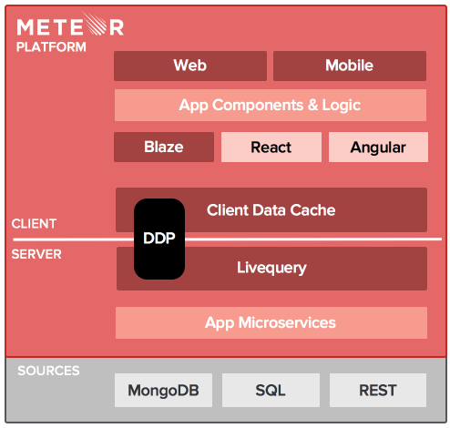

***


***

## what is meteor.js

- fullstack javascript app framework 💪
- easy learning + [good documentation](https://www.meteor.com/install)
- rapid prototyping (insecure first)
- realtime default

***


## what is inside

- pure javascript 😻😻😍
- [ddp](https://www.meteor.com/ddp) "rest for websockets"
- mongodb [livequery](https://www.meteor.com/livequery)
- painless mobile builds
- blaze - reactive template rendering
- [atmosphere](http://atmospherejs.com)

***

## architecture



***

## install

- ```$ curl https://install.meteor.com/ | sh```
- then we haz `$ meteor`

> thats all - all you need is meteor

***

## create & run 🏃

- `$ meteor create leproject`
- `$ meteor`

=>

- nodejs server
- mongodb
- awsome dev enviroment (hot code push)
- minified & concatenated [client](http://localhost:3000)

***

## app structure

- `client`
- `server`
- `/public`
- `/private`
- `lib`

`if(Meteor.isClient)` `if(Meteor.isServer)` `if(Meteor.isCordova)`

***

## load order

- deepest
- `lib`
- by filename
- `main.*` last

[docs.meteor.com](http://docs.meteor.com/#/full/structuringyourapp)

***

## views

- [blaze](https://www.meteor.com/blaze) engine
- [spacebars](https://atmospherejs.com/meteor/spacebars) template language
- simple - no logic in templates
- compile to js

***

## 👉 ui interaction
- helpers
- events

***

## less

`$ meteor add less`

- sourcemap support
- watcher

coffeescript, sass, ...

***

## deploy 😳

`$ meteor deploy yoloyolo1`

(soon) meteor in the [galaxy](http://techcrunch.com/2015/05/19/meteor-raises-20m-to-build-the-one-javascript-stack-to-rule-them-all/#.ii0ymm:uQ6F)

***

## collections

`Yo = new Mongo.Collection('yos');`

- `insert`,`update`&`remove` from client & server
- optimistic ui with minimongo
- autopublish & insecure default

***

## security

> Q: how to make meteor secure?

> A: remove the insecure package

- publish & subscribe
- methods
- allow/deny

***

## mvc with:  [iron:router](https://github.com/iron-meteor/iron-router) ✨

`$ meteor add iron:router`

```js
Router.route('/', function () {
  this.render('Home', {data: {title: 'My Title'}});
});
```

***

## users accounts

`$ meteor add accounts-ui accounts-password`

- fast way: `{{> loginButtons}}`
- {{#if currentUser}}


***

## user relation

#### add message

`user_id: Meteor.userId()`

#### get message

`msgs.map => msg.user = Meteor.users.findOne({_id: msg.user_id})`

***

## oauth 😱

`$ meteor add accounts-facebook`

- Meteor.loginWithFacebook()

***

## seo ... 😡

`$ meteor add spiderable`
> uses the [AJAX Crawling](https://developers.google.com/webmasters/ajax-crawling/docs/learn-more) specification published by Google to serve HTML to compatible spiders (Google, Bing, Yandex, and more).

=> `?_escaped_fragment_=`

***

# the end

# 🚬

***
